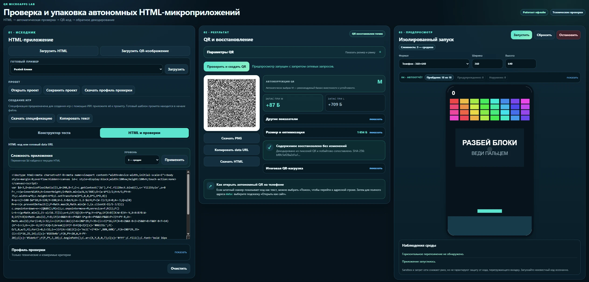

# QR Microapps Lab

Локальный инструмент для проверки и упаковки небольших автономных HTML-приложений в QR-код. Готовая лаборатория работает одним HTML-файлом: без сервера, установки, CDN и подключения к Интернету.

Автор: **[Илья Барило (Ilya Barilo)](https://barilo.ru/)**.

<p align="center">
  <a href="https://ilyabarilo.github.io/qr-microapps-lab/"></a>
</p>
<p align="center">
  <a href="https://github.com/IlyaBarilo/qr-microapps-lab/releases/latest"></a>
  <a href="LICENSE"></a>
  <a href="https://github.com/IlyaBarilo/qr-microapps-lab/actions/workflows/ci.yml"></a>
  <a href="https://github.com/IlyaBarilo/qr-microapps-lab/actions/workflows/pages.yml"></a>
</p>

[Открыть онлайн](https://ilyabarilo.github.io/qr-microapps-lab/) · [Скачать автономный HTML](https://github.com/IlyaBarilo/qr-microapps-lab/releases/latest/download/qr-microapps-lab.html) · [Последний релиз](https://github.com/IlyaBarilo/qr-microapps-lab/releases/latest) · [Практический кейс](docs/case-study-ru.md) · [Спецификация игр](spec_game_creation_ru.md)

> **Статус:** рабочий экспериментальный инструмент. Публичное демо соответствует последнему опубликованному релизу.

[](docs/images/qr-microapps-lab.webp)

```text
HTML → оптимизация → автоматические проверки → QR → обратное декодирование → предпросмотр
```

## Попробовать за 2 минуты

1. [Откройте онлайн-демо](https://ilyabarilo.github.io/qr-microapps-lab/).
2. Выберите готовый пример и нажмите «Загрузить».
3. Нажмите «Проверить и создать QR».
4. Посмотрите автоотчёт и результат обратного декодирования.
5. Запустите приложение во встроенном предпросмотре или скачайте QR.

## Автономный запуск

1. Скачайте [qr-microapps-lab.html](https://github.com/IlyaBarilo/qr-microapps-lab/releases/latest/download/qr-microapps-lab.html).
2. Откройте файл в современном браузере.
3. Загрузите собственный HTML или выберите готовый пример, затем нажмите «Проверить и создать QR».

Стили, исходный код, QRCode.js, jsQR и обязательные лицензионные уведомления уже встроены в этот файл. Для обычного запуска остальные файлы репозитория не нужны.

> QR с `data:` URL может распознаться камерой как текст, а не как обычная веб-ссылка. Возможность открыть его зависит от сканера, браузера и операционной системы телефона.

## Для кого

- для авторов компактных автономных HTML-игр и микроприложений;
- для преподавателей и разработчиков интерактивных учебных материалов;
- для проектов, которым нужен запуск без сервера и подключения к Интернету;
- для разработчиков, проверяющих вместимость, корректность и практическую читаемость QR-кодов.

## Что умеет лаборатория

- принимает готовый HTML или собирает тест в визуальном конструкторе;
- загружает QR-изображение, декодирует коды из других генераторов и показывает версию, матрицу, уровень коррекции, маску, режим данных и геометрию изображения;
- позволяет перенести измеренные уровень коррекции, масштаб модулей и рамку в генератор для сравнительного испытания, не выдавая расчёт за гарантию распознавания телефоном;
- удаляет безопасно устранимое форматирование и показывает экономию;
- проверяет doctype, UTF-8, мобильный viewport, внешние ресурсы, сетевые API и навигацию;
- включает в автоотчёт ошибки выполнения, заблокированные операции и переполнение предпросмотра;
- всегда использует Base64 и автоматически выбирает коррекцию M, а при нехватке вместимости — L с предупреждением;
- позволяет настраивать рамку QR и масштаб полноэкранного отображения;
- рисует модули целым числом пикселей и показывает QR на белом полноэкранном поле;
- декодирует пиксели через независимую библиотеку jsQR и сравнивает нагрузку с исходной;
- запускает приложение в sandbox-предпросмотре с запретом сетевых запросов;
- изменяет сложность любого совместимого HTML через стандартную переменную `$d`;
- содержит встроенную Markdown-спецификацию для создания игр с помощью ИИ, которую можно скачать или скопировать без интернета;
- сохраняет HTML, PNG, профиль, отчёт и переносимый файл проекта;
- содержит восемь встроенных примеров: тест, «Как думает компьютер?», «Турнирная сетка», «Пакет в сети», «Разбей блоки», «Брандмауэр», «Успей в релиз» и «Карьерный компас».

Файл [spec_game_creation_ru.md](spec_game_creation_ru.md) — спецификация для создания совместимых игр с помощью ИИ. Её нужно приложить к промпту; готовый шаблон промпта находится в начале файла. Во время сборки актуальный текст спецификации встраивается в автономную лабораторию и остаётся доступен для скачивания или копирования через блок «Создание игр» без обращения к сети.

## Как контролируется результат ИИ

Лаборатория не считает сгенерированный HTML готовым только потому, что он открылся в браузере. Работа строится как последовательность контрольных точек:

```text
замысел преподавателя → спецификация → HTML от ИИ → автоматические проверки
→ независимое декодирование QR → испытание на телефоне → применение
```

Автоматически проверяются измеримые технические свойства: автономность, вместимость, структура HTML, мобильный интерфейс, запрещённые операции и точность цифрового восстановления. Содержание, удобство и работа на конкретном телефоне требуют отдельной оценки человеком.

## Проверка на реальных устройствах

Автономное приложение удалось запустить из плотного QR-кода на всех трёх проверенных Android-телефонах, в том числе без подключения к Интернету. На двух моделях, работавших под управлением более ранних версий Android и MIUI, штатные камеры QR-код не обнаружили, но специализированные приложения-сканеры успешно его распознали. В этих случаях `data:` URL отображался как текст и требовал ручного открытия в браузере.

Ранняя версия проекта уже использовалась на учебном занятии, однако результаты проверки телефонов тогда не протоколировались. Представленный протокол основан на отдельной серии испытаний трёх Android-телефонов.

Краткие результаты и границы проверки собраны в документе [«Проверка на реальных устройствах»](docs/device-testing-ru.md).

## Структура публичного репозитория

### Каталоги

| Каталог | Зачем нужен |
|---|---|
| `.github/workflows/` | Автоматическая проверка, публикация GitHub Pages и подготовка файлов релиза. |
| `docs/` | Краткие материалы о проверке проекта и изображения для публичной документации. |
| `docs/images/` | Изображения, используемые в README и других публичных материалах проекта. |
| `editor/` | Редактируемые исходники лаборатории: HTML-шаблон, CSS, JavaScript-модули и локальные QR-библиотеки. |
| `editor/vendor/` | QRCode.js, jsQR и тексты их лицензий. Библиотеки включаются в итоговый HTML и не загружаются из CDN. |
| `pages/` | Стартовая страница и служебный файл для публикации GitHub Pages. |
| `tests/` | Проверки, npm-конфигурация, зафиксированные тестовые зависимости и настройки Playwright. |
| `tools/` | Сборщик, объединяющий исходники и лицензии в один `qr-microapps-lab.html`. |

### Файлы в корне

| Файл | Зачем нужен |
|---|---|
| `qr-microapps-lab.html` | Готовая версия программы одним автономным файлом. Это основной результат проекта. |
| `spec_game_creation_ru.md` | Спецификация создания совместимых автономных игр с помощью ИИ и готовый шаблон промпта. |
| `README.md` | Краткое описание, запуск и карта репозитория. |
| `LICENSE` | MIT-лицензия собственного кода проекта. |
| `THIRD_PARTY_NOTICES.md` | Происхождение и лицензии встроенных библиотек. |

## Разработка

Для сборки требуется Node.js 22 или новее. Редактировать нужно файлы в `editor/`; корневой автономный HTML является результатом сборки.

```text
npm --prefix tests run build:standalone
npm --prefix tests run check
```

Полная браузерная проверка после установки зависимостей:

```text
npm --prefix tests ci
npm --prefix tests exec -- playwright install chromium
npm --prefix tests run check:all
```

- `npm --prefix tests run build:standalone` обновляет корневой автономный HTML.
- `npm --prefix tests run check` запускает модульные тесты, проверяет актуальность сборки и структуру репозитория.
- `npm --prefix tests run test:standalone-browser` открывает HTML напрямую через `file://` и убеждается, что сетевых запросов нет.
- `npm --prefix tests run test:e2e` проверяет основные пользовательские сценарии в Chromium.

## GitHub Pages

Единый workflow `Publish release` автоматически запускается при публикации GitHub Release и извлекает проект из соответствующего тега. Он один раз проверяет выбранную версию, подставляет тег в интерфейс, прикрепляет автономный HTML к релизу и публикует тот же файл на GitHub Pages. Содержимое демо, отображаемая версия и скачиваемый релиз поэтому соответствуют друг другу. Для повторной публикации существующего релиза workflow можно запустить вручную, указав его тег. Обычный push в `main` обновляет исходники и запускает CI, но не меняет стабильное демо. Исходный каталог `pages/` не нужен для локального запуска лаборатории.

## Релизы

При публикации GitHub Release workflow `Publish release` подставляет тег релиза в интерфейс и автоматически добавляет готовый `qr-microapps-lab.html`. Создаваемые GitHub архивы `Source code` остаются доступны отдельно.

В отображаемых версиях и тегах конечный нулевой номер исправления опускается: `v0.1` вместо `v0.1.0`, `v1.2` вместо `v1.2.0`. Ненулевой номер сохраняется полностью, например `v0.1.2`.

## Ограничения и безопасность

Корректно созданный QR не гарантирует запуск штатной камерой любого телефона. Результат зависит от физического размера модулей, экрана, освещения, сканера, ОС и того, разрешает ли браузер открывать `data:` URL.

Обратное декодирование jsQR доказывает цифровую корректность сформированных пикселей, но не заменяет проверку камерой реального устройства.

Предпросмотр использует sandbox и CSP с запретом сети. Это уменьшает риск, но не защищает полностью от пользовательского кода, способного зависанием перегрузить вкладку. Не запускайте неизвестный HTML без необходимости.

## Лицензии

| Компонент | Лицензия | Где используется |
|---|---|---|
| Собственный код QR Microapps Lab, © 2026 Ilya Barilo | [MIT](LICENSE) | Редактор, сборщик, тесты и встроенные примеры. |
| [QRCode.js 1.0.0](https://github.com/davidshimjs/qrcodejs) | [MIT](editor/vendor/qrcodejs.LICENSE) | Встроенная генерация QR-кода. |
| [jsQR 1.4.0](https://github.com/cozmo/jsQR) | [Apache-2.0](editor/vendor/jsQR.LICENSE) | Встроенное обратное декодирование QR. |

MIT допускает личное и коммерческое использование, изменение и распространение проекта при сохранении уведомления об авторских правах и текста лицензии. Сторонние компоненты сохраняют собственные лицензии и не перелицензируются как MIT.

Подробные сведения и ссылки на исходные проекты находятся в [THIRD_PARTY_NOTICES.md](THIRD_PARTY_NOTICES.md). Полные тексты лицензий встроенных библиотек сохранены в `editor/vendor/` и внутри `qr-microapps-lab.html`, поэтому автономный файл можно распространять отдельно, не удаляя встроенные уведомления.
