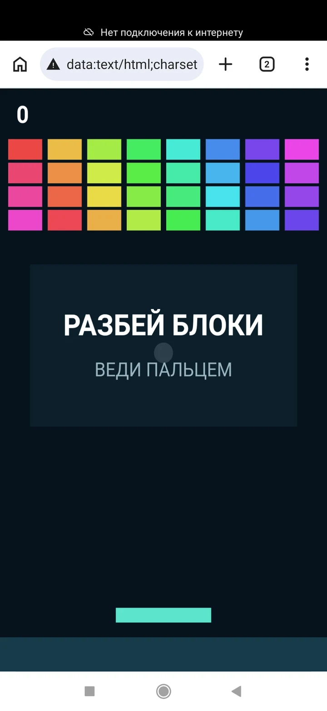
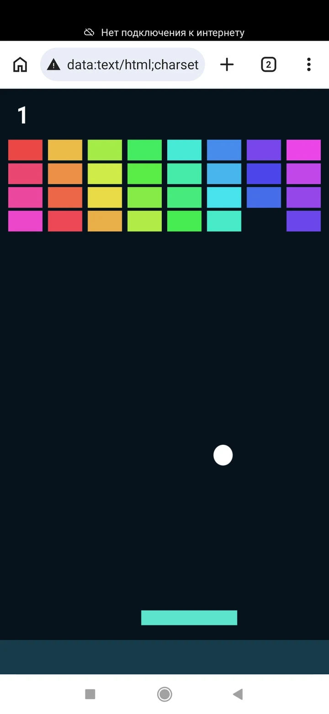
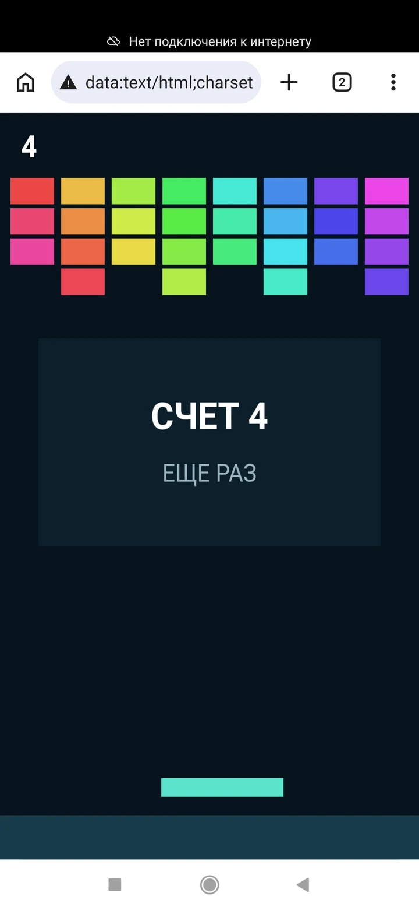

# Проверка на реальных устройствах

Ранняя версия проекта уже использовалась на учебном занятии, но результаты проверки телефонов тогда не сохранялись. Представленный протокол основан на отдельной серии испытаний.

Автономные тестовые приложения сканировались тремя Android-телефонами. В успешных сценариях дополнительно проверялся запуск без подключения к Интернету.

| Устройство | Способ сканирования | Результат |
|---|---|---|
| Redmi Note 13 Pro | Штатное приложение «Фото» | QR распознан как текст. После перехода в Chrome и выбора «Открыть как сайт» приложение запустилось и работало без Интернета. |
| Redmi Note 8 Pro | Штатная камера | QR-код не обнаружен. |
| Redmi Note 8 Pro | Приложение «Сканер» | QR распознан как текст. После передачи `data:` URL в Chrome приложение запустилось без Интернета; взаимодействие и получение итогового результата прошли успешно. |
| Redmi Note 6 Pro | Штатная камера | QR-код не обнаружен. |
| Redmi Note 6 Pro | Приложение «Сканер QR и штрих-кодов» | QR распознан как текст. После копирования `data:` URL в Chrome приложение запустилось и работало без Интернета; взаимодействие прошло успешно. |

## Скриншоты испытаний

### Redmi Note 6 Pro

<table>
  <tr>
    <th>Работа приложения</th>
    <th>Результат взаимодействия</th>
  </tr>
  <tr>
    <td></td>
    <td></td>
  </tr>
</table>

Скриншоты фиксируют запуск приложения через `data:` URL и работу игрового сценария на Redmi Note 6 Pro. В ходе испытания приложение также запускалось и работало без подключения к Интернету, как указано в таблице.

### Redmi Note 8 Pro

<table>
  <tr>
    <th>Запуск без подключения</th>
    <th>Работа приложения</th>
    <th>Результат взаимодействия</th>
  </tr>
  <tr>
    <td></td>
    <td></td>
    <td></td>
  </tr>
</table>

Скриншоты испытания фиксируют запуск приложения из `data:` URL без подключения к Интернету, взаимодействие с ним и итоговый результат. Перед запуском QR-код проверен штатной камерой и приложением «Сканер» по сценариям, указанным в таблице.

### Redmi Note 13 Pro

<table>
  <tr>
    <th>Работа без подключения</th>
    <th>Результат взаимодействия</th>
  </tr>
  <tr>
    <td></td>
    <td></td>
  </tr>
</table>

Скриншоты испытания фиксируют запуск приложения из `data:` URL без подключения к Интернету и результат взаимодействия с ним. Перед запуском QR-код распознан штатным приложением «Фото» по сценарию, указанному в таблице.

> В ходе испытаний штатные камеры Redmi Note 8 Pro и Redmi Note 6 Pro не обнаружили QR-код, а сторонние сканеры на тех же телефонах сработали. Имеющаяся выборка не позволяет отдельно оценить влияние аппаратной части, версии ПО и приложения-сканера.

## Вывод

Испытание подтвердило возможность автономного запуска на проверенных конфигурациях, но не универсальную совместимость. Результат зависит не только от телефона, но и от приложения-сканера: длинный `data:` URL может отображаться как текст или не распознаваться штатной камерой.

Все три телефона проверялись путём сканирования QR-кода с экрана компьютера.
