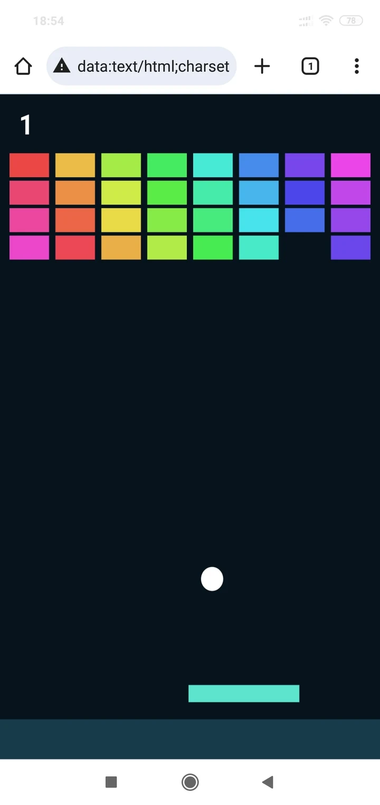
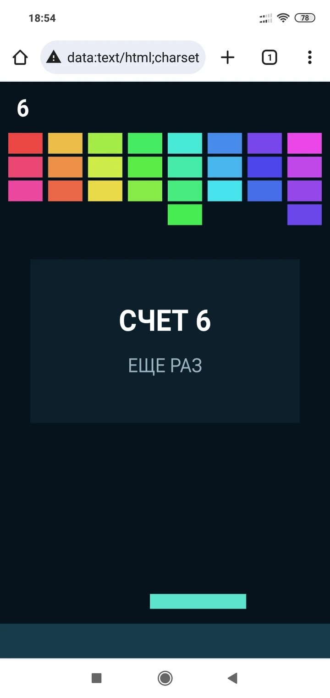
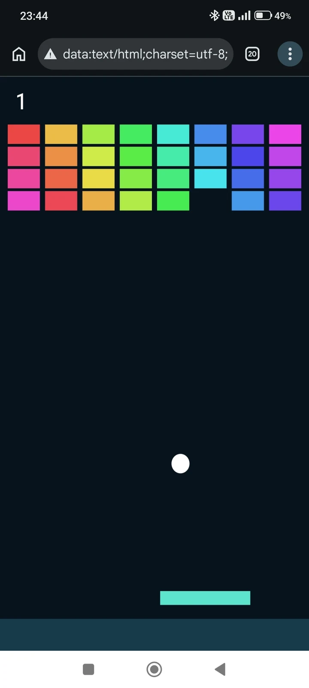
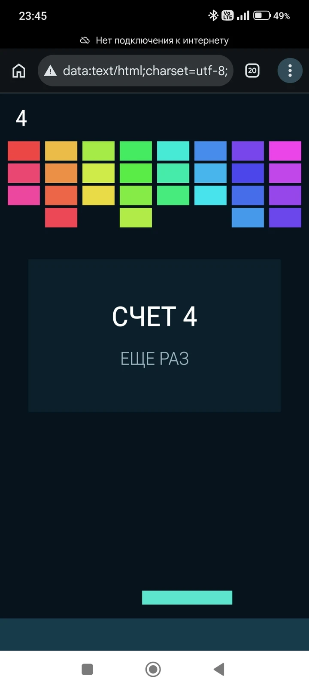

# Проверка на реальных устройствах

Ранняя версия проекта уже использовалась на учебном занятии, но результаты проверки телефонов тогда не сохранялись. Поэтому эти наблюдения не включены в таблицу, а совместимость была проверена повторно отдельной серией.

Автономные тестовые приложения сканировались тремя Android-телефонами. В успешных сценариях дополнительно проверялся запуск без подключения к Интернету.

| Устройство | Способ сканирования | Результат |
|---|---|---|
| Redmi Note 13 Pro | Штатное приложение «Фото» | QR распознан как текст. После перехода в Chrome и выбора «Открыть как сайт» приложение запустилось и работало без Интернета. |
| Redmi Note 8 Pro | Штатная камера | QR-код не обнаружен. |
| Redmi Note 8 Pro | Приложение «Сканер» | QR распознан как текст. После передачи скопированной ссылки в Chrome приложение запустилось и работало без Интернета. |
| Redmi Note 6 Pro | Штатная камера | QR-код не обнаружен. |
| Redmi Note 6 Pro | Приложение «Сканер QR и штрих-кодов» | QR распознан как текст. После копирования `data:` URL в Chrome приложение запустилось; повторные проверки без Интернета прошли успешно. |

## Скриншоты испытаний

### Redmi Note 6 Pro

<table>
  <tr>
    <th>Работа приложения</th>
    <th>Результат взаимодействия</th>
  </tr>
  <tr>
    <td></td>
    <td></td>
  </tr>
</table>

Скриншоты иллюстрируют запуск приложения через `data:` URL и работу игрового сценария на телефоне. Они не служат самостоятельным подтверждением отсутствия подключения к Интернету; этот режим проверялся отдельно и зафиксирован в таблице наблюдений.

### Redmi Note 13 Pro

<table>
  <tr>
    <th>Работа без подключения</th>
    <th>Результат взаимодействия</th>
  </tr>
  <tr>
    <td></td>
    <td></td>
  </tr>
</table>

Скриншоты сделаны из сохранённой вкладки после ранее выполненного распознавания QR-кода и относятся к той же серии наблюдений. Они подтверждают работу приложения из `data:` URL без подключения к Интернету, но не документируют повторное сканирование QR-кода.

> В этой серии отрицательный результат штатных камер получен на Redmi Note 8 Pro и Redmi Note 6 Pro, работавших под управлением более ранних версий Android и MIUI. Сторонние сканеры на тех же телефонах сработали. Имеющаяся выборка не позволяет отдельно оценить влияние аппаратной части, версии ПО и приложения-сканера.

## Вывод

Испытание подтвердило возможность автономного запуска на проверенных конфигурациях, но не универсальную совместимость. Результат зависит не только от телефона, но и от приложения-сканера: длинный `data:` URL может отображаться как текст или не распознаваться штатной камерой.

Первые два телефона проверялись с экрана компьютера. Для Redmi Note 6 Pro носитель не был зафиксирован; печать и проектор отдельно не проверялись.
